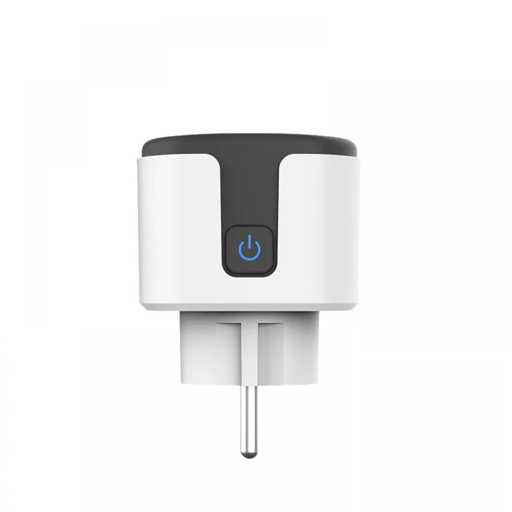

# BetterCozyLife
A Home Assistant integration for Xiaomi branded CozyLife Smart Plugs. This integration provides local control and power monitoring capabilities.


## Supported Devices
⚠️ **IMPORTANT: This integration ONLY works with the CozyLife or Xiaomi-branded Cozylife Smart Plug!**

[Buy it here on AliExpress](https://nl.aliexpress.com/item/1005005991851918.html)



Features of the supported plug:
- Local network control (no cloud required)
- Power monitoring
- On/Off switch

## Features
- 🔌 Local control without cloud dependency
- ⚡ Real-time power monitoring
- 📊 Energy usage statistics
- 🏠 Full Home Assistant integration

## Installation
### Method 1: HACS (Recommended)
1. Open HACS in Home Assistant
2. Click the three dots in the top right corner
3. Select "Custom repositories"
4. Add `https://github.com/IIRoan/bettercozylife` as an Integration
5. Install "BetterCozyLife" from HACS
6. Restart Home Assistant

### Method 2: Manual Installation
1. Download the latest version from the repository  `https://github.com/IIRoan/bettercozylife`
2. Copy the `custom_components/bettercozylife` folder to your `custom_components` folder
3. Restart Home Assistant

## Configuration
1. Go to Home Assistant Settings
2. Click on "Devices & Services"
3. Click the "+ ADD INTEGRATION" button
4. Search for "BetterCozyLife"
5. Enter the IP address of your plug
6. Give your plug a custom name

## Initial Setup and Finding Your Plug's IP Address

Before adding the plug to Home Assistant, you need to set it up on your network:

### Initial Setup (Required First)
1. **Using HomeKit (Recommended for iPhone users):**
   - Plug in the device and wait for the LED to start blinking
   - Open your iPhone's camera and point it at the HomeKit QR code on the plug
   - Follow the HomeKit setup process to connect it to your WiFi network

2. **Using CozyLife App (Alternative method):**
   - Download the CozyLife app from App Store/Play Store
   - Create an account and log in
   - Click the '+' button to add a device
   - Select your 2.4GHz WiFi network and enter the password
   - Follow the app's instructions to complete setup

### Getting the IP Address
After setting up the plug, you can find its IP address by:

1. **Using the CozyLife App (Easiest):**
   - Open the CozyLife app
   - Select your plug
   - Go to device settings/information
   - Look for the IP address field

2. **Using Your Router:**
   - Log into your router's admin panel
   - Look for the connected devices/DHCP client list
   - Find the device with MAC address matching your plug
   - Note the corresponding IP address

3. **Using Network Scanner:**
   - Install a network scanner app like Fing
   - Scan your network
   - Look for a device with MAC address matching your plug

## Entities Created
For each plug, this integration creates:
- A switch entity for controlling the plug
- A power sensor showing real-time power usage in watts

## Troubleshooting
### Common Issues
1. **Can't find the plug**
   - Make sure the plug is connected to your 2.4GHz WiFi network
   - Check if the plug is powered on and the LED is blinking

2. **Connection errors**
   - Verify the IP address is correct
   - Ensure your Home Assistant instance can reach the plug's IP address
   - Check if the plug is responding to ping requests

3. **Power readings not updating**
   - The plug updates its readings every 10 seconds
   - Check if the plug has a good WiFi signal

### Debug Logging
To enable debug logging, add this to your `configuration.yaml`:
```yaml
logger:
  default: info
  logs:
    custom_components.bettercozylife: debug
```

## Support
If you encounter any issues:
1. Check the [Issues](https://github.com/IIRoan/bettercozylife/issues) page
2. Create a new issue if your problem isn't already reported

## License
This project is licensed under the MIT License - see the [LICENSE](LICENSE) file for details